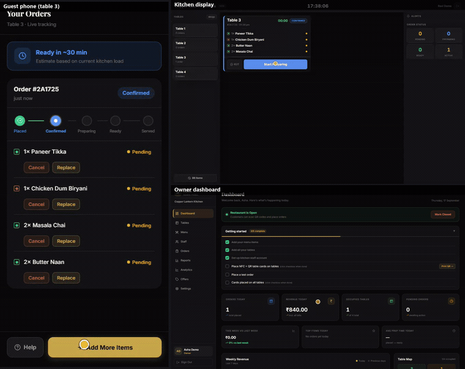
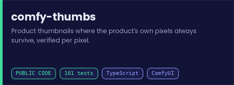
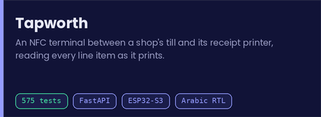
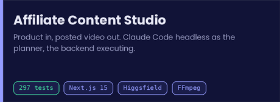
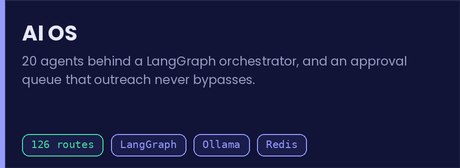
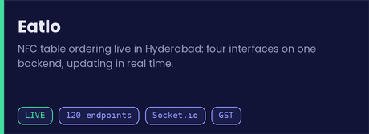
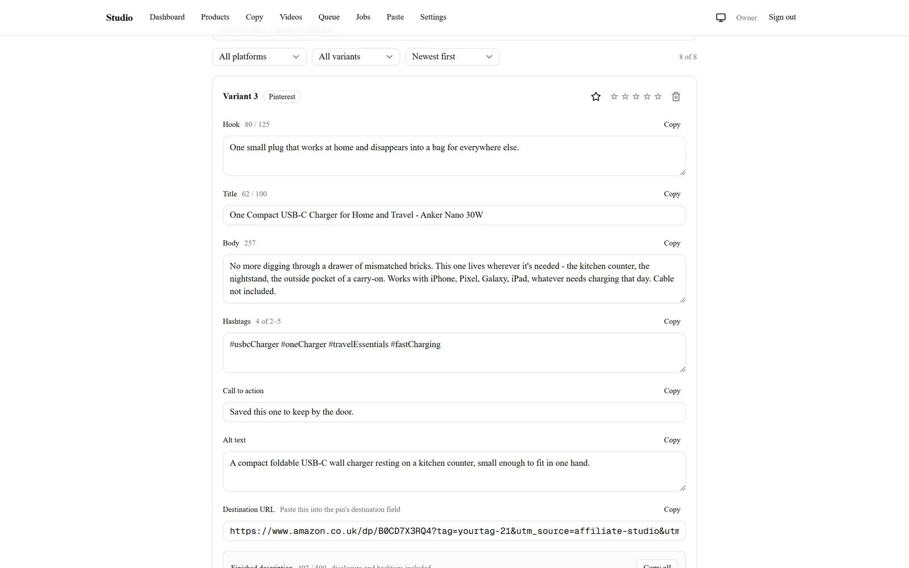
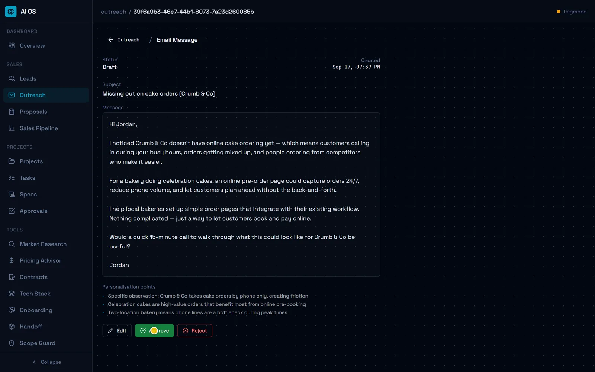
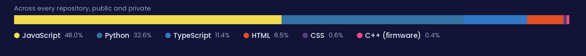

# Mohammed Waliuddin

**From empty repo to deployed** — architecture, tests, hosting, DNS and, on one product, the hardware.

**Live right now** &nbsp;

---

## Not a screenshot — a real run

**One order, three screens, no refresh.** The diner's tracker, the kitchen display and the owner's revenue all move together over Socket.io. Captured from a real local run on 17 September 2026 — subtotal ₹800, CGST ₹20, SGST ₹20, ₹840 landing on the dashboard.

Full capture, event traces and the four bugs it exposed → <a href="https://github.com/M9Bazooka/eatlo-showcase">eatlo-showcase</a>

---

## Read the code

> Most of my work is commercial and private. This one is public in full.

### [comfy-thumbs](https://github.com/M9Bazooka/comfy-thumbs) — where the product's own pixels always survive

Every label, lens marking and grille line above is the **source photo's own pixels**. The lamps, windows and desks are generated.

A model asked to redraw a charger gets the ports wrong and invents a button. For affiliate content — where the picture is a claim about what someone will receive — that isn't a quality problem, it's a false advertisement. So the model never sees the product: it generates only the scene, and the original pixels are composited back at output resolution. Then the client checks every opaque product pixel against the source and **refuses to save the image if one differs by more than 1/255**. Across every render made while building it, the maximum difference was **0**.

| ⏱ Warm render | 🎮 Peak VRAM | 🧪 Tests | ⚙️ CI |
|:---:|:---:|:---:|:---:|
| **7–8 s** / image | **4.33 GB** on an RTX 4060 | **101** cases | Ubuntu + Windows |

`TypeScript` · `ComfyUI` · `sharp` · `Zod` · `vitest` — with a mock ComfyUI replaying recorded real traffic, so the integrity check runs for real in CI without a GPU.

---

## Built and running

<b>🧾 Tapworth</b> — an NFC terminal between a shop's till and its printer &nbsp;<code>built · tapworth.co.uk</code>

 

A low-cost terminal sits inline on the receipt-printer cable, forwards every byte to the printer first, and parses the ESC/POS stream on the way past. Open banking sees "£47 at Tesco"; Tapworth sees the 23 items inside. One capture feeds three products: merchant intelligence, a receipt wallet with an AI agent, and a consent-gated identity score.

- **Grounding is enforced after generation.** No figure reaches the user without a tool result behind it; unsupported output is discarded, not flagged.
- **Guardrails run in code before any model call**, tested in CI. The user's tap creates agent memory, and sending anything is never automated at any autonomy level. About **$0.021** per question.
- **The till never depends on us.** A normally-closed relay means an unpowered or crashed terminal is a direct POS-to-printer wire. Firmware TLS is pinned to the root certificate, not the 90-day leaf.
- **Arabic RTL and dark mode from day one**, with automated EN/AR string-parity checks and a measured contrast auditor.
- **575 backend tests**, Docker, CI, field-level AES-256-GCM encryption, k-anonymity of 5 on merchant analytics.

`Python` `FastAPI` `PostgreSQL` `Redis` `ESP32-S3` `Railway` `Cloudflare`

**[Read the architecture →](https://github.com/M9Bazooka/tapworth-showcase)**

<b>🎬 Affiliate Content Studio</b> — product in, posted video out &nbsp;<code>built · 297 tests</code>

 

Turns an Amazon product into ready-to-post Pinterest and Instagram videos with copy, then tracks what went out.

- **Claude decides, the backend executes.** Claude Code runs headless, writes one validated result file and exits. A clean exit code isn't success; a valid file is.
- **Spend is checked before it happens** — the estimate goes on screen for approval before any render.
- **Compliance is code.** Platform rules live in one module feeding the prompt, the validator and the on-screen counters. Disclosures are added by the backend, never left to a prompt.
- **It outgrew n8n**, so I rebuilt it as an app with a job queue, a worker and live log streaming.

In the captured run the render was **refused** — the Higgsfield account is on the free plan — so the job retried once and failed cleanly with **zero credits spent**. That is the pipeline working, not failing.

`Next.js 15` `Prisma` `Claude Code` `Higgsfield` `FFmpeg` `Zod`

**[Read the write-up →](https://github.com/M9Bazooka/affiliate-content-studio-showcase)**

<b>🤖 AI OS</b> — 20 agents, and an approval queue nothing bypasses &nbsp;<code>built</code>

 

A brief goes in; a spec agent, a task-breakdown agent, research and outreach agents work one job queue behind a LangGraph orchestrator, with status streaming to a dashboard over WebSockets.

- **Sending is not a feature.** The app has no send capability at all — the outreach agent writes a draft, it lands with `status=draft` and `sent_at=None`, and the button a human presses only marks a row as sent. An agent cannot email anyone by design, not by configuration.
- **Local first, escalate deliberately.** Qwen 3 8B through Ollama for ordinary work, the Claude API for hard jobs, routed per agent.
- **20 agents · 126 API routes · 2 LangGraph pipelines · 243 source files.**
- The captured run cost **$0.118** over 320 seconds — and exposed that the pipeline never records its approval pause. That failed check is published in the trace rather than edited out.

`LangGraph` `FastAPI` `Next.js 14` `Ollama` `Redis` `Docker`

**[Read the write-up →](https://github.com/M9Bazooka/ai-os-showcase)**

<b>🍽 Eatlo</b> — NFC table ordering, live in Hyderabad &nbsp;<code>live · eatlo.in</code>

 

Every table gets an NFC and QR card. Diners tap or scan, then order and track their food in the browser with no app.

- **Four interfaces on one backend** — customer, kitchen display, owner dashboard, operator console — across **120 API endpoints** and **25 tables**.
- **A new restaurant goes live in 1.59 s** with the provisioning CLI, 95 ms of it server time.
- **AI menu import** reads a photo into structured items in 13 s, then waits for the owner to review before saving.
- **Built for Indian rules:** veg/non-veg marks, CGST and SGST split on every bill, a scheduled discount engine, staff roles. I designed and sourced the physical table cards too.

`React` `Node` `Express` `PostgreSQL` `Socket.io` `Railway`

**[Read the write-up →](https://github.com/M9Bazooka/eatlo-showcase)**

<b>📇 recruitment-intel</b> — lead scraping and candidate matching for a UK agency &nbsp;<code>built · client work</code>

 

Job-posting lead generation, CV ingestion, hybrid embedding-based candidate matching and human-approved outreach, running as a daily pipeline that prints a morning digest.

- Every external service sits behind a **swappable adapter with a fake implementation**, so the whole system runs and tests with no third-party calls at all.
- **GDPR-first** by design, not by policy note.
- Local embeddings (`BAAI/bge-small-en-v1.5`) or a hosted provider, switched by config.

`Python` `FastAPI` `PostgreSQL` `Alembic` `Docker` `embeddings`

<b>⚔️ Hunter System</b> &nbsp;·&nbsp; <b>🏆 Pookie Cup Bot</b> &nbsp;·&nbsp; <b>🛋 IK Designs</b> &nbsp;·&nbsp; <b>📱 Tap2DineIn</b>

 

- **[Hunter System](https://github.com/M9Bazooka/hunter-system)** — a Solo Leveling-inspired training PWA, offline-capable and local-first, with one XP/rank engine serving both a gym and a calisthenics mode. **121 engine tests.** `TypeScript` `Vite` `PWA`
- **[Pookie Cup Bot](https://github.com/M9Bazooka/pookie-cup-bot)** — a Discord tournament bot for a League community: swiss and double-elimination brackets, a live tier-based draft lottery, captain trades, casting and stats, plus a Claude-powered assistant. `discord.js v14` `Claude` `drizzle` `SQLite`
- **[IK Designs](https://ik-designs.in)** — a commerce platform for a Hyderabad furniture studio: a six-step order builder, public order tracking, a secured admin area with print-ready PDF quotes. It replaced orders taken over WhatsApp. `Next.js 14` `Prisma` — [write-up](https://github.com/M9Bazooka/ik-designs-showcase)
- **Tap2DineIn** — a QR ordering platform built on contract for a UK operator; backend in a ~20-hour sprint, then the customer app. `Express` `Socket.io` `Stripe` — [write-up](https://github.com/M9Bazooka/tap2dineinn-showcase)

<b>🎙 AI automations</b> — a voice agent that answers the phone, and two content pipelines

 

- **Prawn**, an AI voice receptionist for a seafood restaurant: Twilio → n8n → an LLM agent with seven tools → ElevenLabs. It answers menu and allergen questions **only from the menu tool**, never from memory, so it cannot invent a dish or a price. Recognises returning callers before the greeting plays and texts a confirmation after every booking.
- **An end-to-end YouTube pipeline**: one trigger researches a topic, writes a script, generates voiceover, music, images and AI video, and assembles a 1080p film. A master workflow drives eight sub-workflows, each testable alone.
- **A Pinterest/Instagram content factory** with affiliate compliance enforced in code.

**[Read all three →](https://github.com/M9Bazooka/ai-automations-showcase)**

---

## How I build

<table>
<tr>
<td width="33%" valign="top">

### 🧠 The agents type
### I own the design

Claude Code and Cursor write most of the code. I own the architecture, the written contracts they work from, and the tests that decide when something is done.

</td>
<td width="33%" valign="top">

### 🚫 Model output
### is untrusted

Validated, repaired or discarded before it reaches a user. Tapworth deletes any figure it can't back with a tool result; comfy-thumbs refuses to save an image whose product pixels drifted.

</td>
<td width="33%" valign="top">

### 🔒 Rules that matter
### live in code

Guardrails, legal disclosures and spending limits are enforced by code and covered by tests, not requested politely in a prompt.

</td>
</tr>
</table>

---

## Toolkit

**AI & agents**

**Generative media**

**Backend & data**

**Frontend & infra**

---

## Currently building

**🏨 Night Audit** — a Roblox horror game whose rulebook regenerates every shift, so it can't be looked up online. Claude Code drives Roblox Studio and Blender over MCP from a written project contract. I started with no Luau experience.

**🛡 MSc dissertation**, Aston University — a pre-registered study on memory-guided adaptive red teaming of LLMs, with a length-matched **sham-memory control** to separate retrieval gains from simply having examples in context. 502 tests, and a pilot bug fixed as a formal pre-registration amendment rather than a quiet patch.

---

### Background

**MSc Artificial Intelligence** — Aston University, 2025–2026 
**BCA, AI specialisation** — KL University, GPA 9.14/10 
**AWS Certified AI Practitioner** · **IBM AI Developer** · **Automation Anywhere RPA Advanced** 
Founder of **Verris**, an AI studio 
English (professional) · Urdu (native) · Arabic (basic conversational)

 

**Open to Senior AI / full-stack roles in Dubai.**

