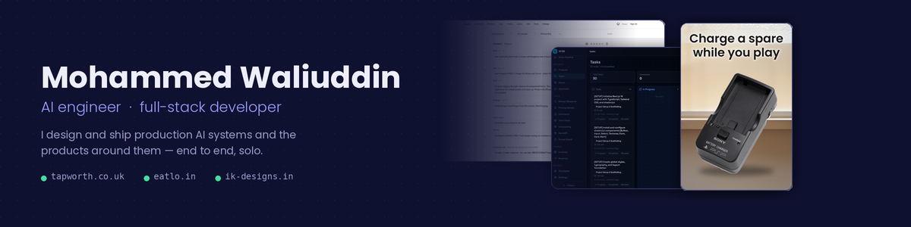
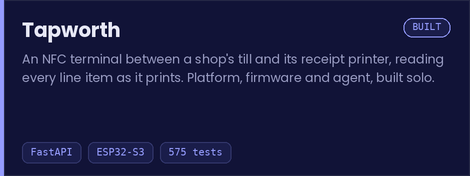
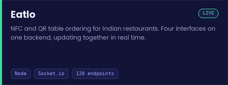
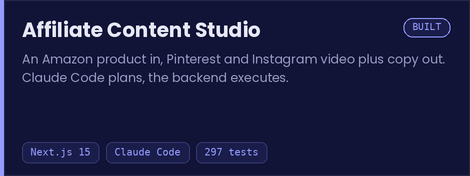
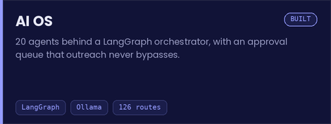
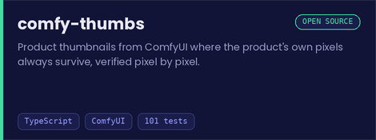
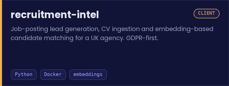

I build AI systems that people actually use, and the products around them. That usually means the whole thing: the architecture, the model work, the front end, the tests, the deployment, the DNS — and on one product, the circuit board. Some of it is mine, some of it belongs to clients, and one is open source.

I work fast with Claude Code and Cursor, which is the point of the engineering rules further down: speed is only worth anything if the result holds up.

 

## What I do

<table>
<tr>
<td width="33%" valign="top">

### AI systems & agents

LLM apps that call tools over real data, multi-agent pipelines, voice agents, and the grounding and guardrail work that makes them safe to put in front of a customer.

</td>
<td width="33%" valign="top">

### Full-stack products

Multi-tenant SaaS, real-time systems, commerce platforms and dashboards — from schema to deployment, including the boring parts that decide whether it survives.

</td>
<td width="33%" valign="top">

### Automation & pipelines

Scrapers, data pipelines, generative-media production and API integrations, in n8n where that fits and in code when it stops fitting.

</td>
</tr>
</table>

 

## Selected work

Each card opens a write-up with the architecture, the decisions and — where I captured one — a recording of the system actually running.

 

## Also built

| | What it is | |
|---|---|---|
| **IK Designs** | A commerce platform for a Hyderabad furniture studio: a six-step order builder, public order tracking by reference number, a secured admin area with print-ready quotes. It replaced orders taken over WhatsApp. | [site](https://ik-designs.in) · [write-up](https://github.com/M9Bazooka/ik-designs-showcase) |
| **AI automations** | A voice agent that answers a restaurant's phone and books real tables, an end-to-end YouTube production pipeline, and a Pinterest/Instagram content factory with compliance enforced in code. | [write-up](https://github.com/M9Bazooka/ai-automations-showcase) |
| **Tap2DineIn** | A QR ordering platform built on contract for a UK operator — table sessions, price-snapshotted orders, a real-time kitchen flow and Stripe payments. | [write-up](https://github.com/M9Bazooka/tap2dineinn-showcase) |
| **Hunter System** | A Solo Leveling-inspired training PWA: offline-capable, local-first, one XP and rank engine serving two training modes. 121 engine tests. | [repo](https://github.com/M9Bazooka/hunter-system) |
| **Pookie Cup Bot** | A Discord tournament bot for a League community: swiss and double-elimination brackets, a live tier-based draft lottery, captain trades and casting, with a Claude-powered assistant. | [repo](https://github.com/M9Bazooka/pookie-cup-bot) |

 

## How I build

> **The agents type. I own the design.**
> Claude Code and Cursor write most of the code. I own the architecture, the written contracts they work from, and the tests that decide when something is done.

> **Model output is untrusted.**
> It gets validated, repaired or discarded before it reaches a user. Tapworth's agent deletes any figure it cannot back with a tool result. comfy-thumbs refuses to save an image whose product pixels drifted from the source photo.

> **Rules that matter live in code.**
> Guardrails, legal disclosures and spending limits are enforced by code and covered by tests, not requested politely in a prompt. AI OS has no send capability at all — an agent there cannot email anyone by design, not by configuration.

> **Publish what broke.**
> When I record a system running, the failures stay in. Capturing real runs this year surfaced a modifier missing from a bill total, a socket event with no listener, and a pipeline that never recorded its own approval pause. They are all in the write-ups.

 

## Stack

 

 

## Currently building

**Night Audit** — a Roblox horror game whose rulebook regenerates every shift, so the answers can't be looked up online. Claude Code drives Roblox Studio and Blender over MCP from a written project contract. I started with no Luau experience.

**MSc dissertation**, Aston University — a pre-registered study on memory-guided adaptive red teaming of LLMs, with a length-matched sham-memory control to separate retrieval gains from simply having examples in context. 502 tests, and a pilot bug filed as a formal pre-registration amendment rather than quietly patched.

 

## Background

**MSc Artificial Intelligence** — Aston University, 2025–2026 
**BCA, AI specialisation** — KL University, GPA 9.14/10 
**AWS Certified AI Practitioner** · **IBM AI Developer** · **Automation Anywhere RPA Advanced** 
Founder of **Verris**, an AI studio building agents, automations and web platforms for businesses 
English (professional) · Urdu (native) · Arabic (basic conversational)

 

## Get in touch

Based in Birmingham, UK. Open to engineering roles, contract work and collaborations — remote or relocating.

If you have something you want built, or you want to talk through how one of these systems works, email is the fastest way to reach me and I'm happy to screen-share any of it.

 

